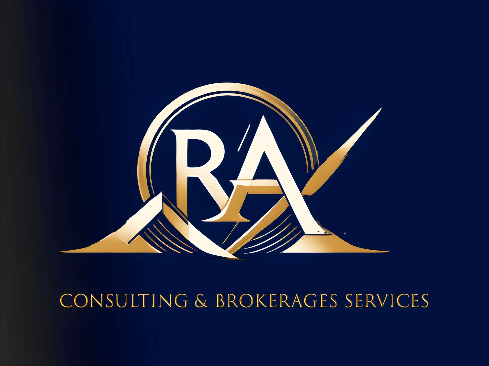
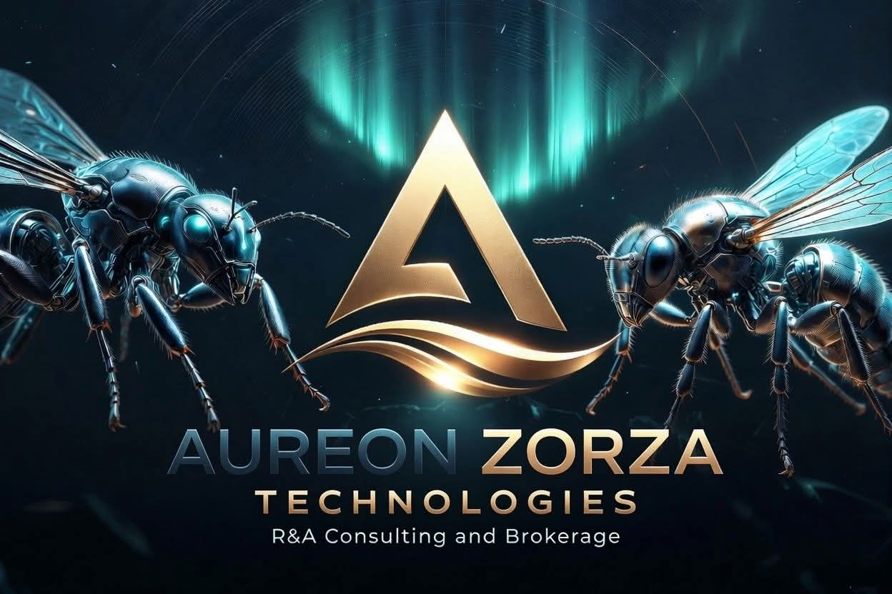
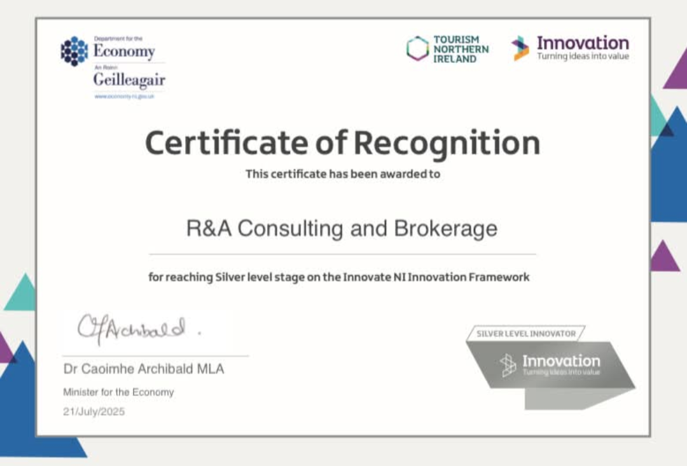
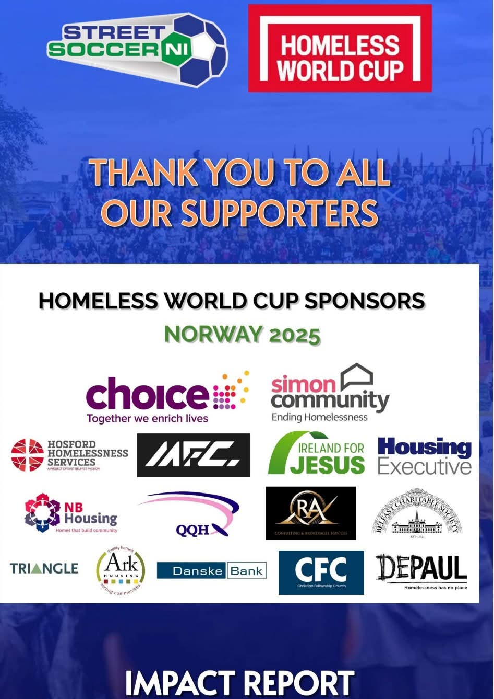

# R&A Consulting and Brokerage Services Ltd

*Trading as **Aureon Zorza Technologies** · Belfast, Northern Ireland, United Kingdom*

---

## Company

| | |
|---|---|
| **Registered name** | R&A Consulting and Brokerage Services Ltd |
| **Company number** | NI696693 (Companies House, Northern Ireland) |
| **Status** | Active |
| **Registered office** | Belfast, Northern Ireland, United Kingdom |
| **Director** | Gary Anthony Leckey |
| **Technology brand / trading name** | Aureon Zorza Technologies |
| **Research identity** | Aureon Institute |
| **Website** | [aureonzorzatechnologies.pl](https://aureonzorzatechnologies.pl) |

> **Aureon Zorza Technologies** is the technology brand and trading name of R&A Consulting and
> Brokerage Services Ltd — it is not a separately registered entity. **Aureon Institute** is the
> research identity under which the Harmonic Nexus Core (HNC) work is published.

Company details are verifiable on the Companies House public register (search company number
**NI696693**).

---

## Recognition

### 🏅 Innovate NI — Silver Level Innovator

R&A Consulting and Brokerage was awarded a **Certificate of Recognition for reaching Silver
level on the Innovate NI Innovation Framework**, issued by the **Department for the Economy**
(with Tourism Northern Ireland and Innovation NI) and signed by **Dr Caoimhe Archibald MLA,
Minister for the Economy**, dated **21 July 2025**.

This is an independent, government-backed recognition of the company's innovation practice — the
credential behind Aureon's positioning as innovation specialists.

### 🤝 Community

R&A Consulting and Brokerage is a supporter of **Street Soccer NI** and the **Homeless World Cup**
(Norway 2025), alongside organisations including Choice, Simon Community, the Housing Executive,
and Belfast Charitable Society.

---

## What the company builds

Aureon is R&A Consulting's flagship platform: a grounded AI operating layer for evidence-heavy,
high-control workflows — spanning trading research, an autonomous operator with a conscience in
the loop, a planetary/HNC research fabric, and a self-building coding organism. See the
[README](README.md) for the platform overview and the
[investor guide](docs/investor/README.md) for the diligence path.

---

## Contact

- **Website** — [aureonzorzatechnologies.pl](https://aureonzorzatechnologies.pl)
- **Repository** — [github.com/RA-CONSULTING/aureon-trading](https://github.com/RA-CONSULTING/aureon-trading)
- **License** — [MIT](LICENSE) · © 2025 R&A Consulting and Brokerage Services Ltd

---

Nothing in this document is an offer of securities or a promise of investment returns. Company and recognition details are stated as verifiable facts.

