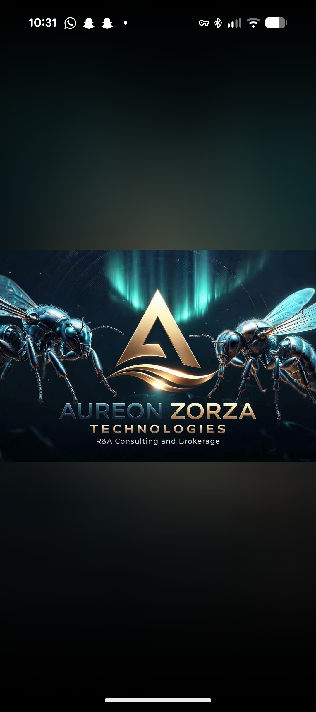
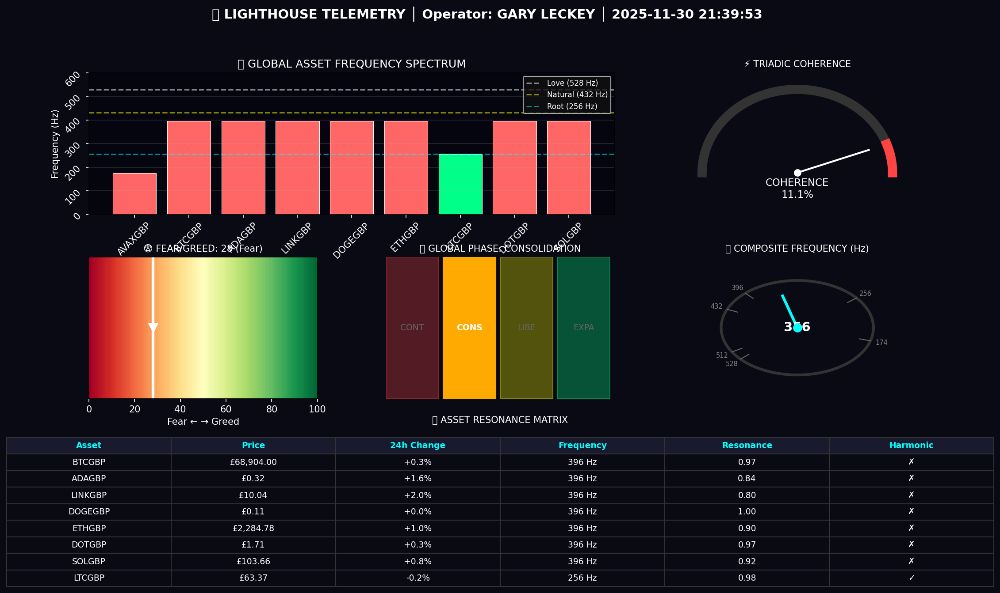
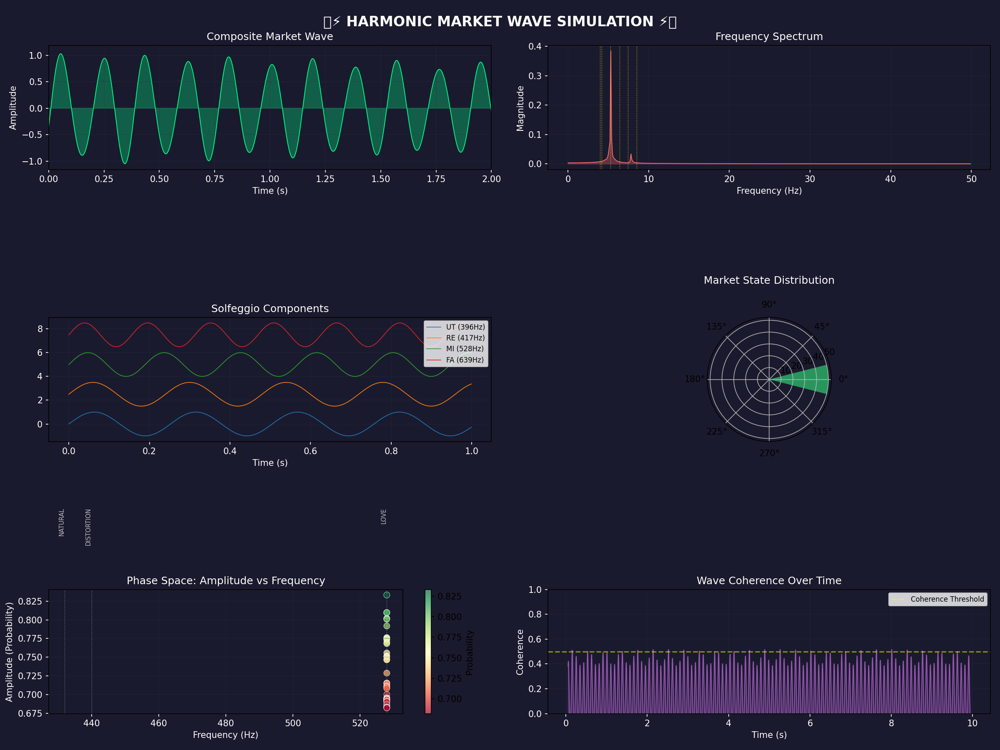

<div align="center">



# Aureon

**A grounded AI operating layer for evidence-heavy, high-control workflows.**
Trading research · autonomous operator · planetary/HNC research · a coding organism — one auditable system.

[](https://github.com/RA-CONSULTING/aureon-trading/actions/workflows/operator-ci.yml)
[](https://github.com/RA-CONSULTING/aureon-trading/actions/workflows/main_ci.yml)
[](LICENSE)


*A product of [R&A Consulting and Brokerage Services Ltd](COMPANY.md) — trading as **Aureon Zorza Technologies** · Belfast, Northern Ireland · Silver-level Innovate NI innovator.*

</div>

---

## What Aureon is

Aureon is a **local-first operating layer** that lets a human operator run, inspect, and
ground evidence-heavy automation across several domains from one place. It is built to be
*auditable first*: code, ledgers, audits, generated interfaces, and research artifacts are
kept together so a reviewer can always see what exists, what is experimental, and what is
ready for controlled use.

It is delivered in three honest layers — each real, each independently reviewable:

1. **The production platform** — the engineering you can run today.
2. **The research framework (HNC)** — pre-registered, falsifiable hypotheses with evidence.
3. **The vision** — the thread that ties the ancient, the mathematical, and the market together.

> This is the formal front door. The original long-form README is preserved unchanged at
> [`docs/archive/README_legacy_20260712.md`](docs/archive/README_legacy_20260712.md) — nothing was removed, only formalized.

---

## 1 · The production platform (what runs today)

| Capability | What it is | Entry point |
|---|---|---|
| **Aureon Operator** | A grounded AI switchboard — routes a prompt through many models, grounds it in the repo, reaches consensus, and applies a conscience veto before answering. | [`aureon/operator/`](aureon/operator/) · [switchboard doc](docs/architecture/AUREON_OPERATOR_SWITCHBOARD.md) |
| **Agentic cognition** | The operator as an agent: repo-wide grounding, tool use (search / read / code / state), hard authority boundaries enforced before any action. | [`aureon/operator/cognition.py`](aureon/operator/cognition.py) |
| **The organism connectome** | The metacognitive layer that senses, touches, and weaves every module of the body — legacy code included — into one living system. | [`aureon/core/aureon_connectome.py`](aureon/core/aureon_connectome.py) · [doc](docs/architecture/ORGANISM_CONNECTOME.md) |
| **SaaS platform** | A categorized catalog of ~1,200 modules, honest health status, a tenancy bridge, and a billing/metering layer, served behind one gateway. | [`aureon/saas/`](aureon/saas/) · [SAAS_PLATFORM.md](docs/SAAS_PLATFORM.md) |
| **Unified console** | One professional React interface — sidebar, command palette, every dashboard as a route — over the whole repo. | [`frontend/`](frontend/) |
| **Production hardening** | WSGI serving, `/healthz` `/readyz` `/metrics`, bearer auth + rate limiting, Docker, a two-tier lint/type gate, CI. | [PRODUCTION_GRADE.md](docs/runbooks/PRODUCTION_GRADE.md) |

<div align="center">


</div>

### Quickstart

```bash
# 1 · the grounded operator (offline-safe; add model keys to go live)
pip install -e '.[operator]'
python -m aureon.operator.operator_server        # serves :8790 — /healthz, /api/cognition/reason

# 2 · the full platform (console + gateway) via Docker
docker compose -f deploy/docker-compose.saas.yml up --build

# 3 · run the strict-tier test suite (offline, no keys/network)
AUREON_LLM_OFFLINE=1 pytest tests/test_operator_*.py tests/test_saas_*.py tests/test_connectome.py -q
```

---

## 2 · The research framework — HNC (pre-registered & falsifiable)

Aureon is built on the **Harmonic Nexus Core (HNC)** — a research framework proposing that a
φ² (golden-ratio-squared) mathematical coherence links ancient knowledge systems, geopolitical
stress in open data, and market dynamics. These are **research hypotheses**, stated as
falsifiable claims with reproduction commands — never as financial promises.

| Claim | Value | Evidence & how to reproduce |
|---|---|---|
| Oil volatility → open-data node activation | r = 0.85, p < 0.001, 24–48h lag | [`CLAIMS_AND_EVIDENCE.md §C1`](docs/CLAIMS_AND_EVIDENCE.md) |
| φ² hydrogen-line reproduction | 1,420.405754 MHz vs NIST 1,420.405752 MHz (ppb) | [`CLAIMS_AND_EVIDENCE.md §C6`](docs/CLAIMS_AND_EVIDENCE.md) |
| Pre-registered predictions (P1–P5) | falsifiable, tracked | [`CLAIMS_AND_EVIDENCE.md`](docs/CLAIMS_AND_EVIDENCE.md) · [falsification protocol](docs/HNC_FALSIFICATION_PROTOCOL.md) |

Every claim links to the file that establishes it and a command you can run. If a claim is not
backed by a source, it is a bug — the repository is the authority. See the full spine in
[`docs/CLAIMS_AND_EVIDENCE.md`](docs/CLAIMS_AND_EVIDENCE.md).

---

## 3 · The vision

> *The same coherence that organized the Ziggurats of Ur, the Great Pyramid, and the Roman road
> network expresses itself now — measurably — in the rhythms of open data and markets. Aureon is
> the instrument built to listen for it, and to act only with a conscience in the loop.*

The full thread — the ancient substrate, the mathematics, the extraction machine, and the
distributed response — is told in the creator's own voice in
[`docs/THE_SYNTHESIS.md`](docs/THE_SYNTHESIS.md).

---

## Company & credentials

**[R&A Consulting and Brokerage Services Ltd](COMPANY.md)** — registered in Northern Ireland,
**company no. NI696693** — trading as **Aureon Zorza Technologies**.

- 🏅 **Silver-level innovator** on the Innovate NI Innovation Framework (Department for the Economy / Tourism NI), awarded 21 July 2025 by the Minister for the Economy. → [certificate](docs/images/innovate_ni_silver_2025.png)
- 🌐 Website: [aureonzorzatechnologies.pl](https://aureonzorzatechnologies.pl)
- 📄 License: [MIT](LICENSE) · © 2025 R&A Consulting and Brokerage Services Ltd
- Full company details: [`COMPANY.md`](COMPANY.md)

---

## Where to go next

| You are… | Start here |
|---|---|
| **An investor or funder** | [`docs/investor/README.md`](docs/investor/README.md) — diligence path, capability categories, and claim discipline |
| **A developer** | [`docs/INDEX.md`](docs/INDEX.md) · [`CAPABILITIES.md`](CAPABILITIES.md) · [`docs/SAAS_PLATFORM.md`](docs/SAAS_PLATFORM.md) |
| **A researcher** | [`docs/THE_SYNTHESIS.md`](docs/THE_SYNTHESIS.md) · [`docs/CLAIMS_AND_EVIDENCE.md`](docs/CLAIMS_AND_EVIDENCE.md) · [`docs/research/READING_PATHS.md`](docs/research/READING_PATHS.md) |
| **Browsing the whole repo** | [`docs/REPO_SITEMAP.md`](docs/REPO_SITEMAP.md) · the console's `#repo-map` tab |
| **Contributing** | [`CONTRIBUTING.md`](CONTRIBUTING.md) · [`SECURITY.md`](SECURITY.md) · [`CODE_OF_CONDUCT.md`](CODE_OF_CONDUCT.md) |

---

## Operating boundaries

Aureon is designed for **controlled local operation with a human in the loop**. Live trading,
warehouse mutation, filing support, payment activity, and other sensitive workflows require
explicit operator review, valid credentials, and route-specific evidence — the platform never
initiates them autonomously. Public documentation describes capability and repository state; it
is **not financial, legal, tax, or regulatory advice**, and nothing here is an offer of
securities or a promise of returns. Private credentials, customer data, and sensitive local
evidence are not published in this repository.

---

<div align="center">
<sub>Aureon · Harmonic Nexus Core — a product of R&A Consulting and Brokerage Services Ltd, trading as Aureon Zorza Technologies.</sub>
</div>
