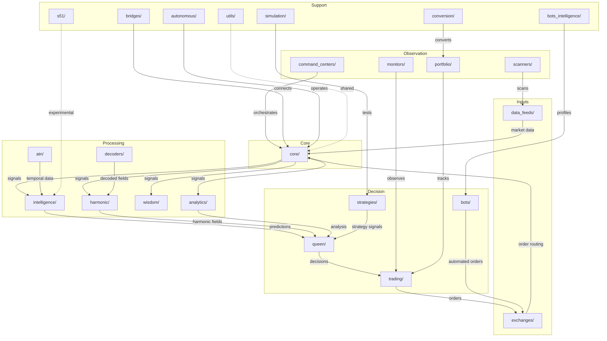

# Aureon Trading System — Modules at a Glance

> **Single-page module reference** for the entire Aureon codebase.
> Every `aureon/` subdirectory is listed with its purpose, key files, and connections to other domains.

---

## System Topology

---

## core/

**Files:** 33 | **Role:** Central nervous system — message routing, event buses, and the unified runtime that every other domain depends on.

| Key Module | Purpose |
|---|---|
| `aureon_nexus.py` | Central nexus connecting all subsystems |
| `aureon_thought_bus.py` | Internal thought/event propagation bus |
| `aureon_chirp_bus.py` | Lightweight signal chirp bus for fast broadcasts |
| `aureon_mycelium_network.py` | Decentralised mesh communication layer |
| `aureon_unified_core.py` | Unified bootstrap and lifecycle manager |

**Connects to:** every domain — all modules route through core buses and the nexus.

---

## trading/

**Files:** 86 | **Role:** Trading execution layer — order placement, kill-chain logic, sniping, and the main live trading loop.

| Key Module | Purpose |
|---|---|
| `aureon_auris_trader.py` | Primary signal-to-order trader |
| `aureon_orca_kill_chain.py` | Multi-step kill-chain execution pipeline |
| `aureon_sniper_elite.py` | Precision entry sniper for tight setups |
| `aureon_live_trading_loop.py` | Main event loop driving live execution |

**Connects to:** exchanges/, queen/, strategies/, portfolio/, monitors/.

---

## exchanges/

**Files:** 37 | **Role:** Multi-exchange connectors — unified abstraction over Kraken, Binance, Alpaca, Capital.com, and others.

| Key Module | Purpose |
|---|---|
| `kraken_client.py` | Kraken REST + WebSocket client |
| `capital_cfd_trader.py` | Capital.com CFD execution client |
| `alpaca_client.py` | Alpaca equities/crypto client |
| `binance_client.py` | Binance spot and futures client |
| `unified_market_trader.py` | Exchange-agnostic order abstraction |

**Connects to:** trading/, data_feeds/, bots/, core/.

---

## autonomous/

**Files:** 35 | **Role:** Autonomous operation and voice interface — enables hands-free cognition, voice commands, and safe desktop control.

| Key Module | Purpose |
|---|---|
| `aureon_unified_voice_agent.py` | Voice-driven agent interface |
| `aureon_cognition_runtime.py` | Autonomous cognition event loop |
| `aureon_conversation_loop.py` | Continuous conversation handler |
| `aureon_safe_desktop_control.py` | Sandboxed desktop automation |

**Connects to:** core/, command_centers/, bridges/, intelligence/.

---

## intelligence/

**Files:** 33 | **Role:** AI/ML prediction — neural forecasting, seer models, and the intelligence registry that catalogues every predictor.

| Key Module | Purpose |
|---|---|
| `aureon_brain.py` | Central neural prediction engine |
| `aureon_seer.py` | Forward-looking probabilistic seer |
| `aureon_lyra_predictor.py` | Lyra sequence-based price predictor |
| `aureon_unified_intelligence_registry.py` | Registry of all intelligence providers |

**Connects to:** core/, queen/, analytics/, harmonic/, s51/, atn/.

---

## harmonic/

**Files:** 23 | **Role:** Harmonic field analysis — planetary harmonics, geopolitical resonance, and field fusion across multiple signal types.

| Key Module | Purpose |
|---|---|
| `aureon_planetary_harmonic_sweep.py` | Planetary cycle harmonic scanner |
| `aureon_harmonic_fusion.py` | Multi-source harmonic field fusion |
| `geopolitical_forensics.py` | Geopolitical event resonance analyser |

**Connects to:** intelligence/, wisdom/, decoders/, strategies/, analytics/.

---

## analytics/

**Files:** 40 | **Role:** Analysis and backtesting — deep money flow, whale profiling, and historical strategy validation.

| Key Module | Purpose |
|---|---|
| `aureon_deep_money_flow_analyzer.py` | Institutional money flow tracker |
| `aureon_whale_profiler.py` | Large-player behaviour profiler |
| `aureon_historical_backtest.py` | Historical strategy backtester |

**Connects to:** intelligence/, trading/, portfolio/, data_feeds/, simulation/.

---

## portfolio/

**Files:** 31 | **Role:** Portfolio and P&L tracking — real-time profit monitoring, portfolio truth reconciliation, and long-term goal tracking.

| Key Module | Purpose |
|---|---|
| `aureon_profit_monitor.py` | Real-time P&L monitor |
| `aureon_portfolio_truth.py` | Ground-truth portfolio reconciliation |
| `aureon_billion_goal_tracker.py` | Long-horizon capital goal tracker |

**Connects to:** trading/, monitors/, conversion/, exchanges/, command_centers/.

---

## queen/

**Files:** 53 | **Role:** Queen AI decision layer — the hive mind that fuses all intelligence streams into final trade decisions and narrates its reasoning.

| Key Module | Purpose |
|---|---|
| `queen_hive_mind.py` | Collective decision fusion engine |
| `queen_neural_implementation.py` | Neural network backing the Queen |
| `queen_cognitive_narrator.py` | Human-readable decision narrator |

**Connects to:** intelligence/, harmonic/, trading/, strategies/, core/, analytics/.

---

## strategies/

**Files:** 35 | **Role:** Trading strategies — encoded strategy logic including the Harmonic Trinity and HNC probability frameworks.

| Key Module | Purpose |
|---|---|
| `harmonic_trinity.py` | Three-harmonic convergence strategy |
| `hnc_probability_matrix.py` | HNC probability scoring matrix |
| `hnc_master_protocol.py` | Master HNC strategy protocol |

**Connects to:** queen/, trading/, intelligence/, harmonic/, simulation/.

---

## scanners/

**Files:** 18 | **Role:** Market scanners — live momentum hunting, global wave detection, and ocean-wave pattern recognition.

| Key Module | Purpose |
|---|---|
| `aureon_live_momentum_hunter.py` | Real-time momentum burst scanner |
| `aureon_global_wave_scanner.py` | Cross-market wave pattern detector |
| `aureon_ocean_wave_scanner.py` | Ocean-wave fractal scanner |

**Connects to:** data_feeds/, analytics/, trading/, monitors/.

---

## monitors/

**Files:** 24 | **Role:** Live monitoring — dashboards, power monitors, and real-time system health displays.

| Key Module | Purpose |
|---|---|
| `aureon_live_monitor.py` | Core live system monitor |
| `aureon_pro_dashboard.py` | Professional trading dashboard |
| `aureon_power_monitor_live.py` | Power and resource monitor |

**Connects to:** trading/, portfolio/, core/, command_centers/, scanners/.

---

## command_centers/

**Files:** 16 | **Role:** Orchestration — top-level command centres, system hub dashboards, and strategic war planning.

| Key Module | Purpose |
|---|---|
| `aureon_command_center.py` | Primary orchestration console |
| `aureon_system_hub_dashboard.py` | Unified system hub dashboard |
| `aureon_strategic_war_planner.py` | Strategic campaign planner |

**Connects to:** core/, monitors/, trading/, autonomous/, portfolio/.

---

## simulation/

**Files:** 34 | **Role:** Simulations and demos — HNC simulations, multiverse scenario testing, and quantum telescope projections.

| Key Module | Purpose |
|---|---|
| `aureon_hnc_simulation.py` | HNC strategy simulation engine |
| `aureon_multiverse.py` | Multi-scenario parallel simulator |
| `aureon_quantum_telescope.py` | Far-future projection telescope |

**Connects to:** strategies/, analytics/, intelligence/, trading/.

---

## conversion/

**Files:** 10 | **Role:** Conversion engines — automated position conversion, ladder climbing, and capital reallocation.

| Key Module | Purpose |
|---|---|
| `aureon_conversion_commando.py` | Aggressive position conversion engine |
| `aureon_ladder_climber.py` | Incremental ladder conversion strategy |

**Connects to:** portfolio/, trading/, exchanges/.

---

## data_feeds/

**Files:** 20 | **Role:** Market data feeds — live price streams, HFT WebSocket routing, and the live TV station data visualiser.

| Key Module | Purpose |
|---|---|
| `aureon_live_market_feed.py` | Consolidated live market data feed |
| `aureon_hft_websocket_order_router.py` | High-frequency WebSocket order router |
| `aureon_live_tv_station.py` | Real-time data visualisation station |

**Connects to:** exchanges/, core/, scanners/, analytics/, trading/.

---

## wisdom/

**Files:** 35 | **Role:** Ancient wisdom integration — ghost dance protocols, enigma ciphers, and Celtic harmonic overlays applied to market timing.

| Key Module | Purpose |
|---|---|
| `aureon_ghost_dance_protocol.py` | Ghost dance temporal timing protocol |
| `aureon_enigma.py` | Enigma cipher-based signal encoding |
| `aureon_celtic_harmonic.py` | Celtic harmonic cycle overlay |

**Connects to:** harmonic/, decoders/, intelligence/, strategies/.

---

## bridges/

**Files:** 17 | **Role:** Cross-system bridges — frontend bridge for the UI, ML bridge for model serving, and the Nexus-Earth bridge for external data.

| Key Module | Purpose |
|---|---|
| `aureon_frontend_bridge.py` | Frontend/UI communication bridge |
| `aureon_bridge_ml.py` | ML model serving bridge |
| `aureon_nexus_earth_bridge.py` | External earth-data ingestion bridge |

**Connects to:** core/, autonomous/, intelligence/, data_feeds/.

---

## bots_intelligence/

**Files:** 21 | **Role:** Bot detection and profiling — entity attribution, bot hunting dashboards, and adversarial bot fingerprinting.

| Key Module | Purpose |
|---|---|
| `aureon_bot_entity_attribution.py` | Bot entity attribution engine |
| `aureon_bot_hunter_dashboard.py` | Bot detection dashboard |

**Connects to:** bots/, analytics/, monitors/, intelligence/.

---

## bots/

**Files:** 32 | **Role:** Bot implementations — the Gaia family of autonomous traders covering turbo, unity, and planetary reclamation strategies.

| Key Module | Purpose |
|---|---|
| `gaia_turbo_trader.py` | High-speed turbo trading bot |
| `gaia_unity_trader.py` | Balanced unity trading bot |
| `gaia_planetary_reclaimer.py` | Long-horizon planetary reclamation bot |

**Connects to:** trading/, exchanges/, strategies/, bots_intelligence/.

---

## s51/

**Files:** 5 | **Role:** Section 51 experimental — bleeding-edge compound strategies and experimental signal research.

| Key Module | Purpose |
|---|---|
| `aureon_51.py` | Section 51 experimental core |
| `aureon_51_compound.py` | Compound experimental strategy |

**Connects to:** intelligence/, strategies/, simulation/.

---

## atn/

**Files:** 3 | **Role:** Astronomical Temporal Nexus — astro-temporal monitoring and forensic analysis of celestial timing signals.

| Key Module | Purpose |
|---|---|
| `aureon_atn_monitor.py` | Astronomical temporal monitor |
| `aureon_atn_forensics.py` | Astro-temporal forensics analyser |

**Connects to:** intelligence/, harmonic/, wisdom/.

---

## utils/

**Files:** 41 | **Role:** Shared utilities — profit gates, aura validation, and common helpers used across every domain.

| Key Module | Purpose |
|---|---|
| `adaptive_prime_profit_gate.py` | Adaptive prime-number profit gate |
| `aura_validator.py` | Signal aura validation utility |

**Connects to:** all domains — utility code is imported system-wide.

---

## decoders/

**Files:** 11 | **Role:** Hermetic-to-code translation — decoding ancient symbol systems (Emerald Tablet, Ogham, Egyptian, Aztec) into computable signal overlays.

| Key Module | Purpose |
|---|---|
| `emerald_spec.py` | Emerald Tablet specification decoder |
| `celtic_ogham.py` | Celtic Ogham alphabet decoder |
| `egyptian_decoder.py` | Egyptian hieroglyphic signal decoder |
| `aztec_decoder.py` | Aztec calendar cycle decoder |

**Connects to:** wisdom/, harmonic/, intelligence/.

---

## Summary

**Total: 715 Python modules across 24 domains.**

---

## Related Documentation

- [Intelligence Wiring Matrix](architecture/INTELLIGENCE_WIRING_MATRIX.md) — how intelligence providers are wired together
- [Repository Mindmap](architecture/REPO_MINDMAP.md) — visual map of the full repository structure
- [Navigation Guide](NAVIGATION_GUIDE.md) — how to find your way around the codebase
