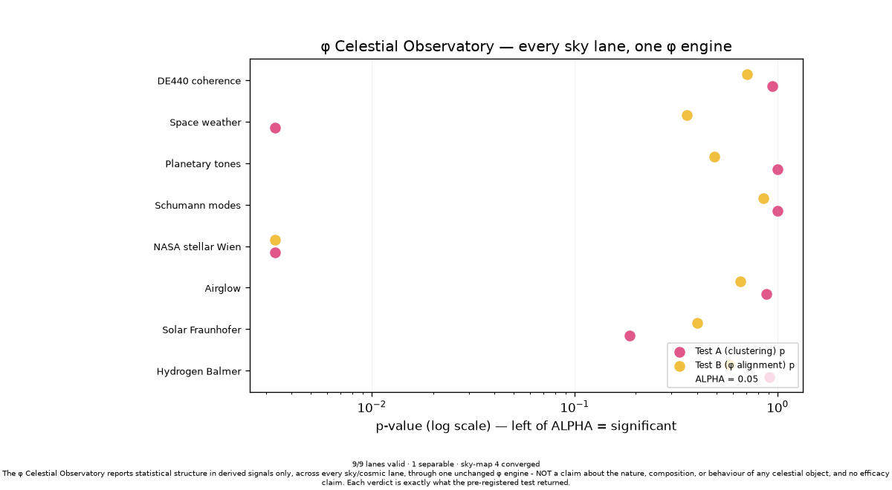

# The φ Celestial Observatory — every sky lane, one engine

*The capstone. One instrument that operates every sky-facing φ sensor through the
same unchanged phenolic engine and reports one consolidated picture.*

## What it is

`aureon/bio/celestial_observatory.py` doesn't add a new sensor — it **operates all of
them at once**. Each lane is an existing governed scorer (`score_signal`:
consent/provenance → controls → Operator/conscience veto → Test A / Test B →
separability at `ALPHA`); the observatory runs them and tabulates exactly what the
pre-registered test returned for each, neutrally. The φ engine is never modified.

## The lanes

| Lane | Domain | Source |
|------|--------|--------|
| Hydrogen Balmer | starlight (emission) | `sky_signal_adapter` catalog |
| Solar Fraunhofer | sunlight (absorption) | `sky_signal_adapter` catalog |
| Airglow | nightglow (self-emission) | `sky_signal_adapter` catalog |
| Diffuse night sky | diffuse background (anchor) | `sky_signal_adapter` |
| NASA stellar Wien | host-star colour | `sky_map` stellar sources (pooled) |
| Schumann modes | ionosphere (ELF) | `cosmic_scan` |
| Planetary tones | orbital (Cosmic Octave) | `cosmic_scan` |
| Space weather | solar (Kp/ap/F10.7) | `cosmic_scan` |
| DE440 coherence | planetary coherence | `coherence_scan` |
| All-sky map | RA/Dec convergence | `sky_map` (summary) |

## The boundary (load-bearing)

`OBSERVATORY_BOUNDARY`: statistical structure in derived signals only, across every
lane, through one unchanged φ engine — **NOT** a claim about the nature, composition,
or behaviour of any celestial object, and no efficacy claim. Each verdict is exactly
what the pre-registered test returned.

## The consolidated picture (whatever the tests return)

Reported exactly as the engine outputs them, neutrally (seed-fixed, deterministic):

| Lane | tones | Test A p | Test B p | separable |
|------|-------|----------|----------|-----------|
| Hydrogen Balmer | 7 | 0.907 | 0.575 | False |
| Solar Fraunhofer | 21 | 0.186 | 0.402 | False |
| Airglow | 10 | 0.877 | 0.655 | False |
| Diffuse night sky | 0 | — | — | False (anchor) |
| NASA stellar Wien | 1000 | 0.003 | 0.003 | **True** |
| Schumann modes | 7 | 1.000 | 0.847 | False |
| Planetary tones | 6 | 1.000 | 0.488 | False |
| Space weather | 14 | 0.003 | 0.355 | False |
| DE440 coherence | 23 | 0.940 | 0.704 | False |

**9/9 lanes valid**; the all-sky map reports **4 converged cells of 63 scored**.
Every number is the engine's own verdict — the observatory makes no claim beyond
tabulating them.



## Run it

```bash
python -m aureon.bio.celestial_observatory --render observatory.png
```

Benchmarked as Tier-A invariant **b20 "φ Celestial Observatory"** in
`tests/benchmarks/benchmark_aureon_scope.py` (Tier-A 20/20). Fully offline; lanes whose
data is absent degrade to a skipped reading so it runs anywhere. See
[SENSOR_SUITE.md](SENSOR_SUITE.md) for the per-lane catalog.
