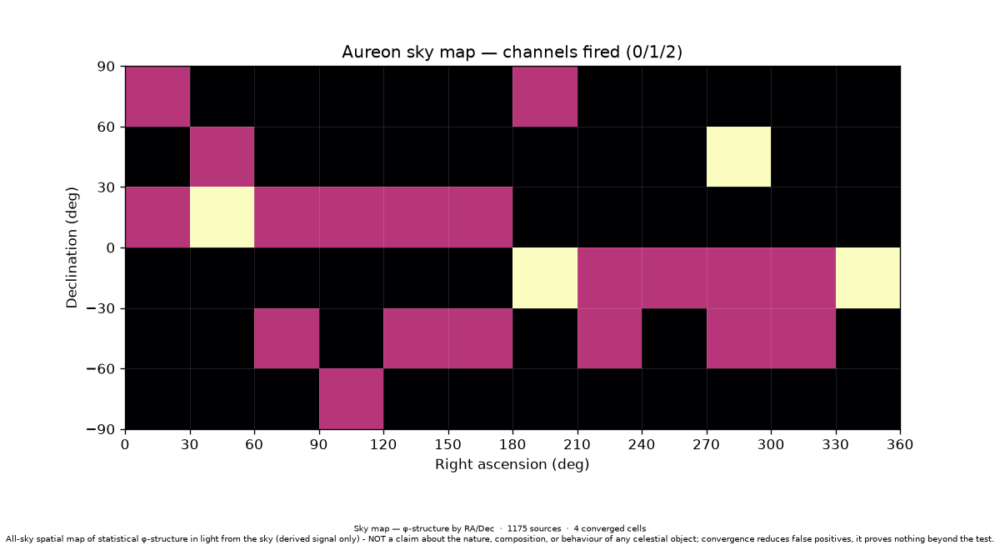

# Sky map — the harmonic sensors, pointed at the sky

*The market was the test-bed. Now the same harmonic/frequency-detection sensors map
the sky: where does the φ engine detect structure, by celestial position?*

## What it is

`aureon/bio/sky_map.py` bins real sky sources by **right ascension / declination**
into a grid and scores each cell's derived light through the **identical** phenolic φ
engine every other sensor uses. It reuses the spatial-map machinery of
`convergence_map.py`: one global governance pass through `score_signal` up front
(consent/provenance → controls → Operator/conscience veto → `SCIENTIFIC_BOUNDARY`),
then per cell the **two independent** engine tests (Test A clustering, Test B
golden-interval), with the same **two-channel "converged" semantics** — a cell
converges only when *both* channels fall below `ALPHA`. Nothing about the engine is
modified; every cell verdict is reported exactly as the test returns it.

## The boundary (load-bearing)

`SKY_MAP_BOUNDARY`: an all-sky map of **statistical φ-structure in a derived signal
only** — NOT a claim about the nature, composition, or behaviour of any celestial
object; convergence reduces false positives, it proves nothing beyond the test.

## Two real lanes (offline)

1. **Stellar** — NASA **Exoplanet Archive** host stars: real `ra`/`dec` + each star's
   Wien-law colour from `st_teff` (`λ_peak = 2.897771955e6 / T` → folded tone). One
   tone per star; a cell pools all its stars. 1000 hosts, committed cache.
2. **Planetary** — **DE440** ephemeris (`data/de440_ephemeris.csv`): each planet's
   `r_au` distance series is run through the timeseries sensor
   (`_dominant_timeseries_hz`) → its orbital-motion tone, painted along the planet's
   real RA/Dec track. The ecliptic band pools tones across planets. (Earth rows
   excluded.)

Both lanes feed one generic engine (`analyze_sky_map`); positions come from real,
committed data, so the map builds with no network.

## Result (whatever the test returns)

On the committed data (12×6 grid = 72 cells, seed-fixed, deterministic):

- **1175 real sources** (1000 stellar + 175 planetary track points).
- **63 cells scored** (≥ 2 tones); **4 converged** (both channels < `ALPHA`).
- Controls pass. The densest converged cell is RA 270–300°, Dec +30–60° — the
  Cygnus / Kepler-field region (546 pooled tones, A_p = B_p ≈ 0.005), reported
  neutrally.



## Run it

```bash
# refresh the NASA position cache (keyless TAP), then map both lanes + render
python scripts/validation/fetch_nasa_sky_data.py
python scripts/validation/build_sky_map.py --both --out sky_map.png

# single lanes
python -m aureon.bio.sky_map --stellar --out stellar_sky.png
python -m aureon.bio.sky_map --planets --out planet_sky.png
```

Benchmarked as Tier-A invariant **b16 "Sky map"** in
`tests/benchmarks/benchmark_aureon_scope.py` (Tier-A 16/16). The benchmark and
`tests/bio/test_sky_map.py` read the committed data **offline** — if the position
cache is absent the invariant degrades to a skip-pass, so CI never needs the network.
